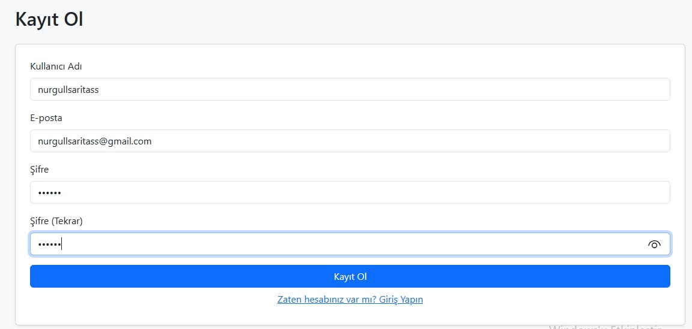
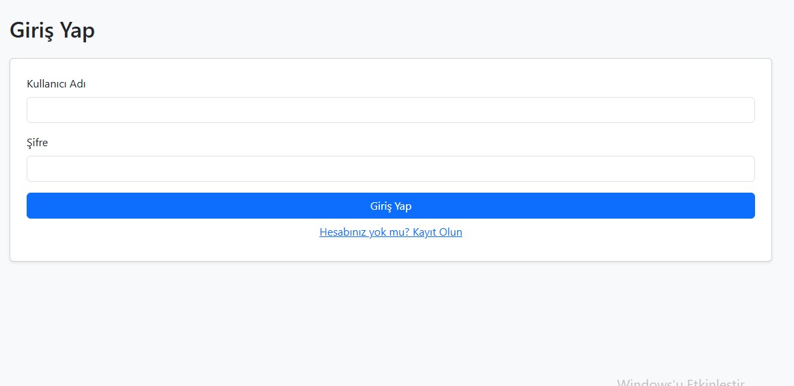
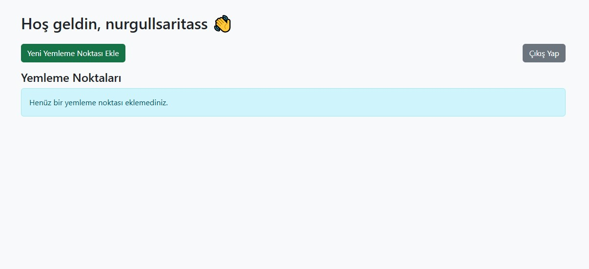
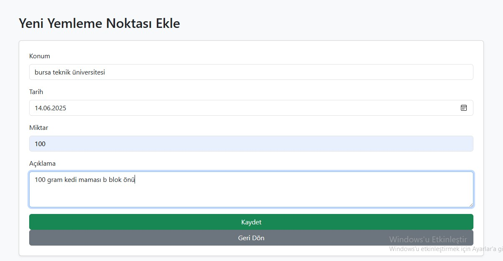
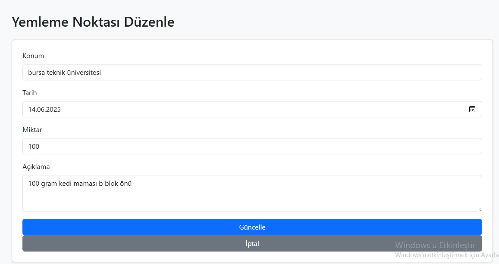
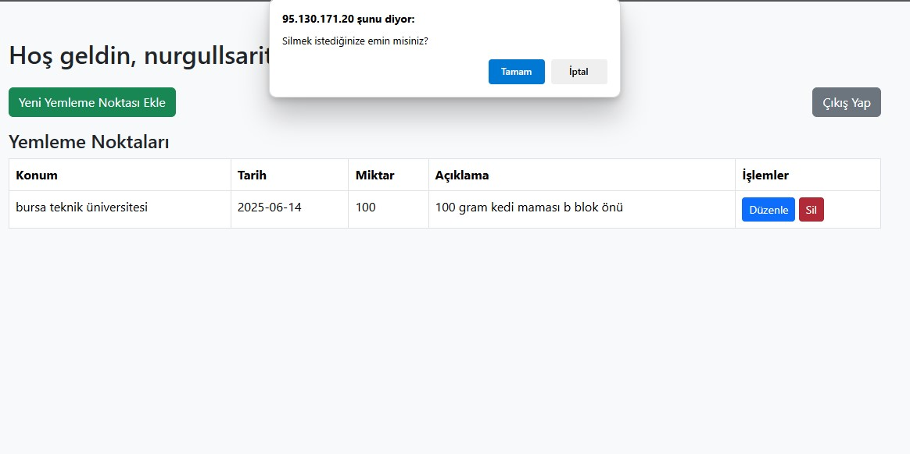

# Yemleme Noktası Takip Uygulaması

[SOKAK HAYVANLARI İÇİN YEMLEME NOKTASI TAKİP SİSTEMİNE ERİŞMEK İÇİN TIKLAYINIZ](http://95.130.171.20/~st22360859022)

[UYGULAMA AÇIKLAMA VİDEOSU İÇİN TIKLAYINIZ](https://www.youtube.com/watch?v=KuScy2aqOyI)

## Proje Hakkında

Bu proje, kullanıcıların sokak hayvanları için yem bıraktıkları noktaları kaydedip, düzenleyip, listeleyebileceği basit bir sistemdir. Php ile geliştirilmiş olup, ön yüzünde Bootstrap CSS kütüphanesi kullanılmıştır.

Kullanıcılar sisteme kayıt olabilir, giriş yapabilir ve kendi yemleme noktalarını yönetebilir.

## Özellikler

- Kullanıcı kayıt ve giriş sistemi (şifreler güvenli şekilde hashlenmiştir)
- Kişisel yemleme noktası ekleme, düzenleme ve silme
- Yemleme noktalarının listelenmesi
- Oturum bazlı güvenlik kontrolleri
- Bootstrap tabanlı kullanıcı arayüzü

## Kurulum ve Kullanım

1. Proje dosyalarını sunucunuza yükleyin.
2. `config.php` dosyasındaki veritabanı bilgilerini kendi veritabanı bilgilerinize göre düzenleyin.
3. Veritabanında aşağıdaki tabloların oluşturulduğundan emin olun:
    - `users`
    - `feeding_points`
4. Tarayıcıda projenin ana dizinine giderek kayıt olup kullanmaya başlayabilirsiniz.

## Kullanılan Teknolojiler

- PHP 
- MySQL
- Bootstrap (CSS ile tasarım için)

## Proje Notları

- Backend PHP ile yazılmıştır.
- Veritabanı işlemleri PDO ile güvenli şekilde yapılmaktadır.
- Bootstrap yalnızca arayüz için kullanılmıştır; harici PHP kütüphanesi veya framework yoktur.
- Oturum yönetimi PHP session ile sağlanmaktadır.

## Veritabanı Yönetimi

Veritabanı işlemleri için aşağıdaki phpMyAdmin bağlantısı kullanılabilir:

[phpMyAdmin Giriş](http://95.130.171.20/phpmyadmin)

Bu bağlantı üzerinden giriş yapılıp oluşturulmuş veri tabanı üzerinden :
- **Tablo oluşturma**
- **Var olan tabloları düzenleme**
- **Veri ekleme ve silme**
- **SQL sorguları çalıştırma** işlemleri yapıldı.

## Kullandığım tablolar

### users Tablosu

- id: INT (Primary Key, AUTO_INCREMENT)
- username: VARCHAR
- email: VARCHAR
- password: VARCHAR
- created_at: TIMESTAMP (Varsayılan CURRENT_TIMESTAMP)

### feeding_points Tablosu

- id: INT (Primary Key, AUTO_INCREMENT)
- user_id: INT (users tablosundaki id ile ilişkilidir)
- location: VARCHAR
- feeding_date: DATE
- amount: VARCHAR
- description: TEXT
- created_at: TIMESTAMP (Varsayılan CURRENT_TIMESTAMP)

## Uygulamaya dair ekran görüntüleri

###  Kayıt Ol Sayfası

###  Giriş Yap Sayfası

###  Kontrol Paneli 
Kullanıcı giriş yaptıktan sonra tüm yemleme noktaları burada listelenir.

###  Yeni Yemleme Noktası Ekle

###  Yemleme Noktası Düzenle

###  Yemleme Noktası Sil

**çıkış yaptıktan sonra giriş ekranına döner**

## Geliştirici 
Nurgül Sarıtaş 

